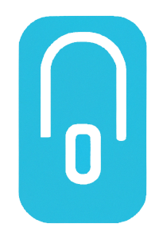

<h1 align="center">MidLock</h1>
<p align="center">
  
</p>
Este repositorio contiene el código fuente y la documentación relacionada con el proyecto del sistema de "locker" de medicamentos. El objetivo de este proyecto es desarrollar un sistema automatizado para farmacias e instituciones de salud que permita el almacenamiento seguro y el acceso controlado a medicamentos mediante el uso de códigos QR.

## Componentes principales
Este repositorio contiene el proyecto integrador que tiene los siguientes componentes:

- **React**, a JavaScript library for building user interfaces.
- **Tailwind** CSS, a highly-customizable, low-level CSS framework.
- **Vite**, a fast and efficient build tool for modern web development.

## Características principales
- **Escaneo de códigos QR:** Los usuarios podrán acceder a su medicamento específico escaneando un código QR único asociado a su pedido.

- **Almacenamiento seguro:** El sistema de "lockers" proporcionará casilleros individuales para cada paciente, garantizando la privacidad y seguridad de los medicamentos.

- **Gestión eficiente:** Se implementará una interfaz intuitiva y amigable para facilitar la gestión de medicamentos por parte del personal de la farmacia o institución de salud.

## Desplegue
```shell
$ git clone https://github.com/Commmodore64/midlock.git/
$ cd midlock
$ npm install
```
Una vez instalada las dependencias, puedes iniciar el servidor:
```shell
$ npm run dev
This will start the development server and you can access your application at http://localhost:``.
```
